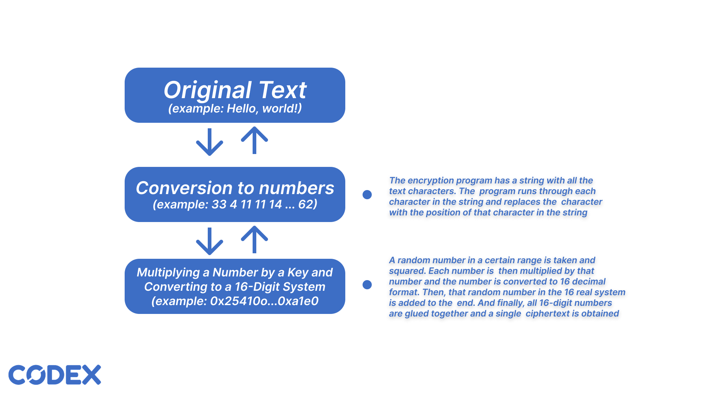

<h1 align="center">Codex Encoder 16 (CE16)</h1>
CE16 is an open-source text-based encoding project designed to ensure data security and privacy. The project is available for study and modification, allowing users to adapt it to their needs.

 

# Content
- [Encoding Algoritm](#encoding-algoritm)

# Encoding Algoritm

The text encryption algorithm in CE16 consists of 2 steps - converting characters to numbers and multiplying the number with a key and then converting it to a 16-digit system